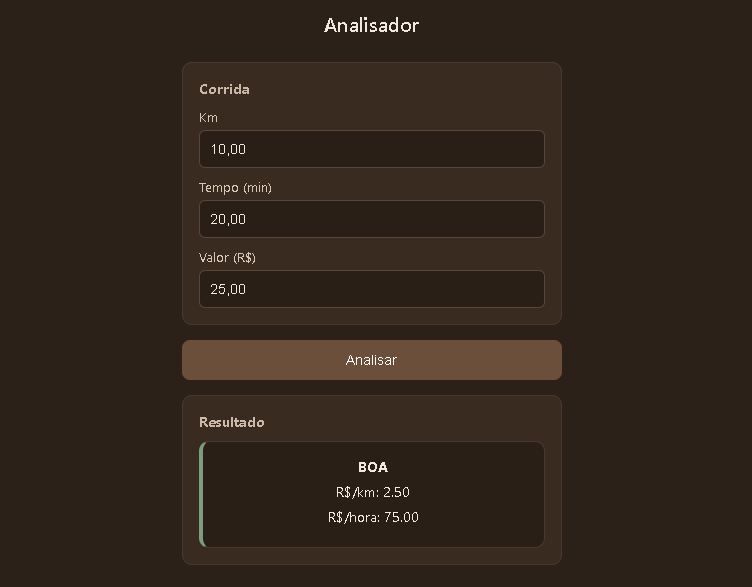

# Analisador de Corridas (Versão Inicial)

Aplicação web simples para ajudar motoristas de aplicativo a analisarem rapidamente se uma corrida vale a pena.

---

## Ideia

A proposta é auxiliar na tomada de decisão, mostrando de forma rápida:

* Valor por KM
* Valor por hora
* Classificação da corrida (boa, aceitável ou ruim)

---

## Como Funciona

O usuário informa:

* Quilometragem (KM)
* Tempo estimado (minutos)
* Valor da corrida (R$)

O sistema calcula automaticamente os indicadores e exibe o resultado.

---

## Preview


<p align="center">
  
</p>

---

## Tecnologias Utilizadas

* HTML5
* CSS3
* JavaScript (Vanilla)

---

## Como Executar

```bash id="run-project"
git clone https://github.com/seu-usuario/analisador-de-corridas.git
cd analisador-de-corridas
```

Abra o arquivo `index.html` no navegador.

---

## Regras Atuais

* R$ 1,70 por KM
* R$ 30,00 por hora

Classificação:

* BOA → atende os dois critérios
* ACEITÁVEL → atende um dos critérios
* RUIM → não atende nenhum

(Esses valores ainda são fixos e poderão ser configuráveis no futuro.)

---

## Próximos Passos

* Permitir personalização dos critérios (valor por KM e por hora)
* Salvar configurações do usuário
* Adicionar cálculo de lucro baseado em custo por KM
* Criar área de configuração do motorista
* Evoluir a análise considerando custos reais do veículo (combustível, manutenção, etc.)
* Melhorar a interface
* Criar versão mobile (PWA)

---

## Autor

Rodrigo Valentim
[rodrigovalentim.rs@gmail.com](mailto:rodrigovalentim.rs@gmail.com)

---

## Observação

Este projeto faz parte da minha evolução como desenvolvedor.
